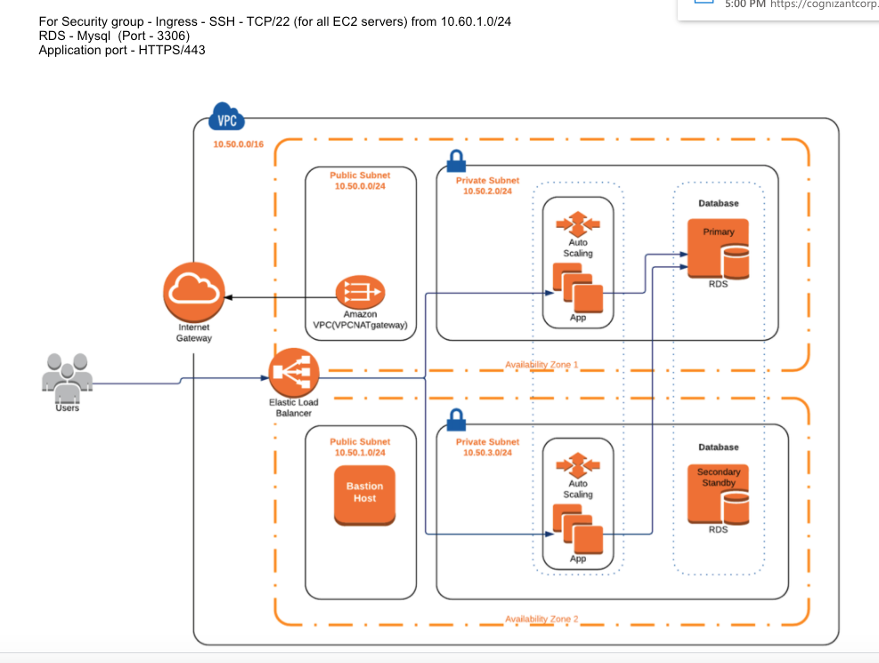

# usbank POC DEMO

********************************************************************************************
- Terraform IAC FOR USBANK POC which includes the following:
- 1. Autoscaling 4 compute nodes across 2 AZs
- 2. MySQL DB Instance across 2 AZs
- 3. ALB, IGW, NATGW 
- 4. Bastain Host
- 5. (2) Public Subnets, (2) Private Subnets, which includes (1) dedicated dual database subnets
- 6. ALL EC2s in ASG are attached to ELB
- 7. S3 Bucket with VPC folder for VPC state file
- 8. S3 Bucket with compute folder for IAC state file
- 9. S3 Bucket with elb folder for Elb log files
- 10 .KMS key mgmt for secure bastian host access and logging
********************************************************************************************

